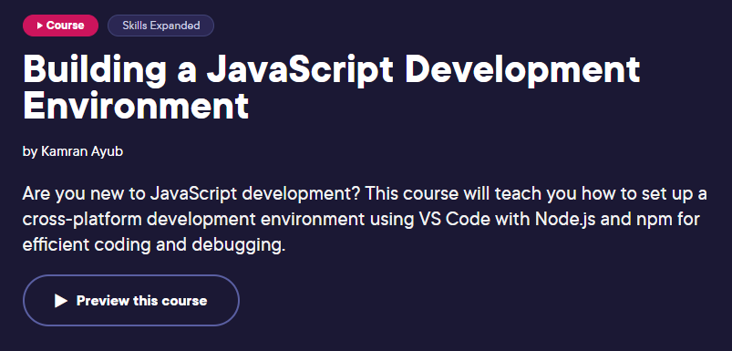

# Building a JavaScript Development Environment Pluralsight Course

This repository is for the Pluralsight course **[Building a JavaScript Development Environment](https://bit.ly/PSJSDevEnvCourse)**. The license is Apache 2.0.

## What You'll Learn

Setting up a JavaScript development environment can be daunting, often leading to frustration and lost productivity. In this course, Building a JavaScript Development Environment, you'll learn how to create an integrated development environment (IDE), setting you up for success in your JavaScript projects. First, you'll see how to install and configure Visual Studio Code, a powerful IDE for your JavaScript projects. Next, you'll install Node.js and npm, ensuring you have the right foundation for running and testing your JavaScript code. Finally, you'll learn what capabilities Visual Studio Code offers for debugging. When you're finished with this course, you'll have the skills and knowledge to set up a JavaScript development environment needed to efficiently build and debug applications.

## Table of Contents

1. [Errata](#errata)
1. [Updates](#updates)
1. [Additional Resources](#additional-resources)

## Errata

*None yet*

Please report course issues using the [Issues](issues) page or the Pluralsight discussion page.

## Updates

- **May 2024**
  - Initial release 🎉

## Additional Resources
